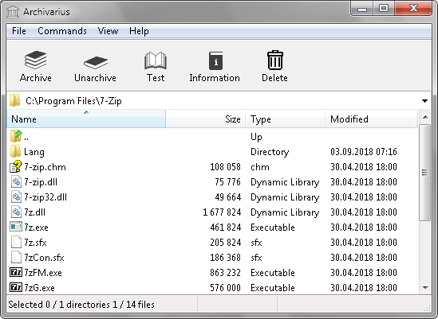

## Archivarius 0.3.1
Archivarius is file archiver with powerfull
compression algorithms such as LZRE, CM.  
LZRE is dictonary method LZ77 with binary 
range coder. CM is context mixing at bit level.  
Have GUI version.  
Compression only in solid mode.  
AES 128 encryption.  
Files larger than 4 GB are supported.  
Unicode supported for files of archives,  
localisations in UTF-8 format.  
Available languages are English, Russian.  
Archive file extension arv.

## License
All archivarius source code files are under license Apache-2.0.  
License text in file [Apache-2.0 license](license.txt).  
Copyright (C) 2018-2020 Theodorus Software.  
theodorusoftware@gmail.com.

## Requirements
| Type       | Description                        |
|------------|------------------------------------|
| OS         | Windows 7 and higher               |
| Platform   | x86, x64                           |
| Language   | C++                                |
| Compiler   | Visual C++ 16 and higher           |
| Build tool | GNU Make                           |

## Directorys overview
| Directory   | Description          |
|-------------|----------------------|
| bin         | Executable files     |
| build       | Makefiles for build  |
| code        | Source code          |
| doc         | Documentation        |

## Building instruction
Building all makefiles with GNU Make, from build directory.  
Before building you need set paths to compiler binarys, headers,  
librarys in system variables path, include, lib.  
  
launch command line  
cd build  
make [targets]

## Command line syntax
Detailed instruction in file [command line syntax](doc/txt/command-line-syntax.txt).

## Version history
Detailed information about the different versions  
of archiver in file [history](doc/txt/version-history.txt).

## GUI
| Main window                      | Encode settings                      |
|----------------------------------|--------------------------------------|
|  |  |
